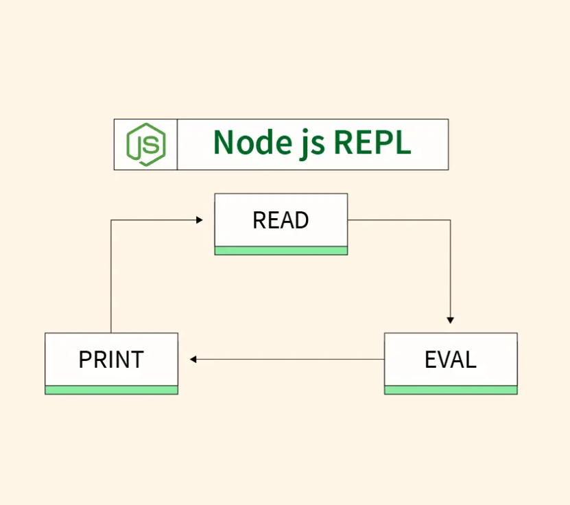

## What is REPL?
REPL stands for Read → Eval → Print → Loop. 
It is an interactive programming environment we can use to type codes. This system immidiately evaluates  and gives results.



1. Read - Read the codes you enter
2. Eval - Run and evaluate the result
3. Print - Displays the result
4. Loop - Waits for the next command

For example, in Haskell, the REPL is called GHCi.

You can type:
```haskell
    Prelude> 5 + 3
    8
```


## What is a Thunk?   
Thunk is a delayed computation.
When an expression is assigned to a variable, it's called thunk.

```bash
Consider: let x = 1 + 2 in x * x. How many thunks are created? 
a) 0 
b) 1 
c) 2 
d) 3 
Answer: b 
```

## Functions in FP are first-class values.
First class value means that:
- can store in a variable
- pass it as an argument
- return it from a function
- Put it inside data structures(lists, tuples, objects, etc)

In huskell functions are also first-class. 
```huskell
    square x = x * x
    f = square
    result = f 4
```    
## What is the answer `print((+1) 3)`?
output: 4
Because `(+1)` is a function.


##  What is Huskell Language Server(HLS)?
HLS gives intelligence to the coding editor about the huskell language features.
For example, in VS Code, HLS can provide:

- Error highlighting while you type
- Type information and suggestions
- Go to definition
- Automatic code actions/refactoring
- Type information on hover
- Formatting support
- Better project support
